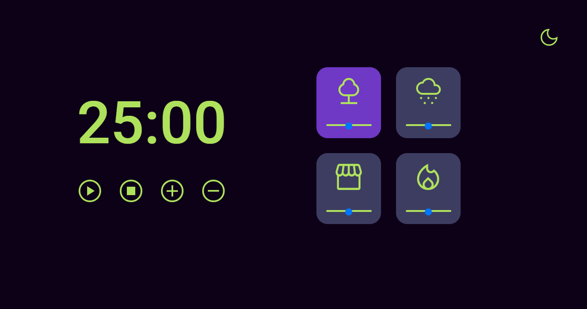

# Focus Timer Pomodoro Style

> Trilha Explorer

Desafio construído do zero a partir de um layout do figma, mas como a queridinha rocket nos permite alterar os estilos eu fiz umas mudanças nas cores.
O primeiro desafio era construir o focustimer 2.0, e o segundo era fazer a sua versão dark. Esses desafios são do stage 5 (avançando no JavaScript) da trilha Explorer da RocketSeat. Consegui absorver muito conhecimento nesse stage, e já vou me preparar pra entrar no stage 6, xD

[🔗 Clique aqui para acessar](https://filipesantos07.github.io/FocusTimer-2.0-with-DarkMode/)

## 🛠️ Tecnologias

- HTML
- CSS
- JavaScript

## 💛 Contato

FilipeSantosEstudos1@gmail.com